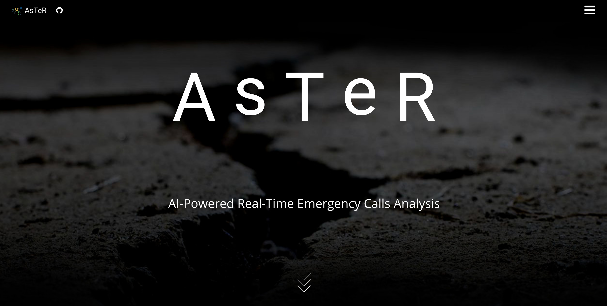

# aster-website

`Author: Meryll Dindin`

## Set up your environment:

```bash
git clone https://github.com/Project-AsTeR/aster-website.git
virtualenv -p python3 aster-website
cd aster-website
mkdir config
source bin/activate
pip install -r requirements.txt
```

## Configure Flask:

**config/config-main.json**

```python
{
    "secret-key": "5y2znLF4Q8xec"
}
```

**config/config-mail.json**

```python
{
    "MAIL_SERVER": "smtp.gmail.com",
    "MAIL_PORT": 587,
    "MAIL_USE_SSL": false,
    "MAIL_USE_TLS": true,
    "MAIL_USERNAME": "xxx",
    "MAIL_PASSWORD": "xxx"
}
```

## From developpement to production:

Hosting a website, getting the appropriate certificates, setting the right listeners to accept HTTPS, here is what it takes with AWS. 

1) **Get the domaine name:**

The first step is simple: Buy an available domain name with **Route 53**.

2) **Setup a running instance with the project:**

Because this project is based on _Flask_, we use the AWS **Elastic Beanstalk** service to run our application online. This service consists in a basic container running on an **EC2** instance and linked to a **S3** bucket for storage. In our case, the application itself does not require a lot of computational power (we do not host our deep learning models there), so we will opt for a **single virtual core** and **4 GB** of RAM (_t2.micro_ instance, which is also the default choice when setting up an instance). Now, AWS generally makes our lives easier as we do not even have to know all of that, or how subnets work, security groups, load balancers, IPs, gateways, and so on. Either you do it online with a clickable solution, either you use the **eb cli**, which is my favorite. AWS do provide great [tutorials](https://docs.aws.amazon.com/en_pv/elasticbeanstalk/latest/dg/ebextensions.html), and [templates](https://github.com/awsdocs/elastic-beanstalk-samples/tree/master/configuration-files) to configure your instance. In our case, only one file needs to be defined: `.elasticbeanstalk/config.yml`. (FYI: Pick the `Application` load balancer.) I will redirect anyone to the tutorials for that purpose. One may notice three other files in the project: `.ebextensions/https-instance.config`, which modifies core services to handle the HTTPS requests; `.ebextensions/upgrade_pip.config`, which is a set of command to force _setuptools_ and _pip_ upgrades; `.ebignore`, which is similar as a _.gitignore_ file, in the sense that you will only host on the instance what is necessary for it to run properly.

From there, you can already access and visualize your application running online, under a name such as _service.id.zone.aws.com_. However, this is not done through secured connections and this is boring.

3) **Get the SSL certificates:**

Unfortunately, your instance cannot use the HTTPS protocol without having SSL certificates. Usually, people would work with **openssl**, which is pretty straightforward. In our case, AWS makes our life easier once again, with the **Certificate Manager** service. You can then create your own certificate based on the domain name you previously bought.

4) **Setup a listener for HTTPS:**

Once again, everything is as simple as a click. Open the configuration of your **Elastic Beanstalk** instance, and click on _Modify_ under **Load Balancer**. There, add a new **listener** that redirects 443 (HTTPS) to 80 (HTTP) with the appropriate SSL certificate you created just before.

5) **Redirect your domain name to your actual instance:**

Here, we will dive back into the **Route 53**. Two objects have to be configured for to redirect the requests: a `Canonical Name`, such as _random.domain-name_ that takes as value your **EB** instance; an `Alias`, such as _www.domain-name_ for your **EB** instance as well. With those two records, you will be good to go!

## Latest front page rendered:

